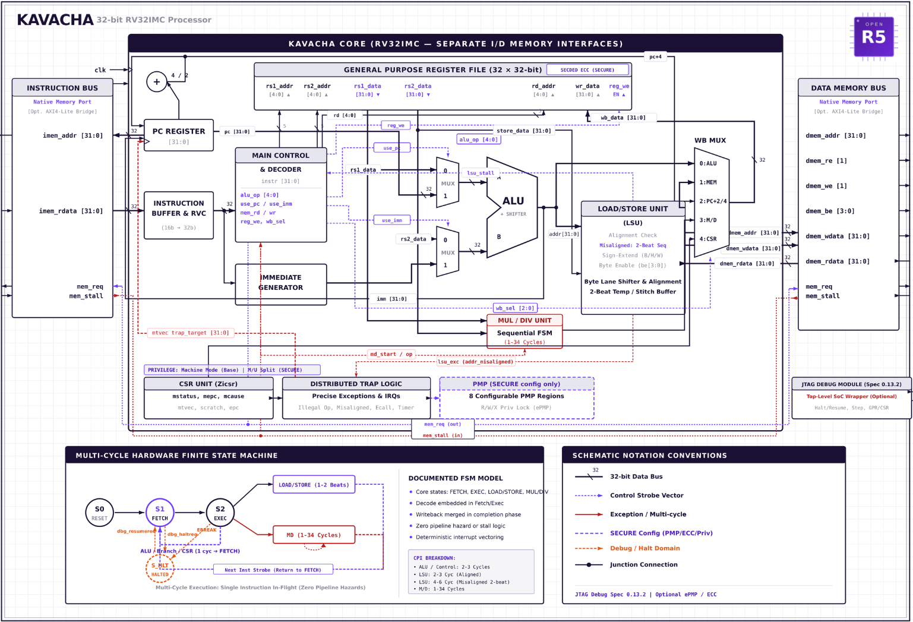

<div align="center">

# Kavacha

<p align="center">
  
</p>

<p align="center">
  
  
  
  <a href="https://www.linkedin.com/company/open-risc-v/"></a>
  <a href="https://or5.org"></a>
</p>
</div>

## About

**Kavacha** (*"armour"* in Sanskrit) is a compact, area-optimized **RV32IMC** processor core.
It executes one instruction at a time through a small multi-cycle finite state machine — no pipeline, no forwarding, and no hazard logic — which keeps the design tiny, deterministic, and straightforward to verify.

Kavacha targets roles where silicon area, power, and security matter more than peak throughput:

-  **Secure boot ROMs and management engines**
-  **Deeply embedded control-plane state machines**
-  **FPGA soft cores for prototyping and production**
-  **IoT microcontrollers with tight area budgets**
-  **Safety-critical subsystems (automotive, industrial, space)**


## Overview

| Property | Value |
|----------|-------|
| ISA | RV32IMC + Zicsr |
| Microarchitecture | Multi-cycle FSM, non-pipelined |
| Privilege modes | Machine; optional User (`SECURE`) |
| Debug | RISC-V External Debug 0.13 over JTAG (DTM + DM; `dmstatus.version` = 2) |
| Bus interfaces | Native memory port + AXI4-Lite |
| Verification | Official riscv-tests (rv32ui/um/uc/mi), golden co-simulation, RVFI, self-checks |


---




## Features

### Predictable, Zero-Hazard Execution
A single instruction walks a short FSM (`FETCH → EXEC → {LOAD | MD} → FETCH`).
There is nothing to forward and no hazard to detect — behaviour is completely
deterministic, and correctness is easy to establish.

###  Two-Tier Trust Model
The optional `SECURE` configuration adds a **User privilege mode** and an **8-region Physical Memory Protection (PMP)** unit with **Smepmp** (`mseccfg`) rules: Machine Mode Lockdown (MML), Machine Mode Whitelist Policy (MMWP) and Rule Locking Bypass (RLB). With MML set, locked rules become Machine-only, unlocked rules become User-only, Machine mode cannot execute from memory that matches no rule, and new executable Machine-mode rules cannot be added. User-mode access to Machine-level CSRs and `MRET` raise illegal-instruction traps.

> These checks are exercised by `./build.sh upriv` and `./build.sh mml`. The design has not had an independent security review.

###  Register File ECC
The `SECURE` configuration replaces the plain register file with a **SECDED** (single-error-correct, double-error-detect) protected version. Each register is stored with check bits so that a single-bit upset is corrected on read and a double-bit upset is detected — critical for radiation-sensitive and reliability-critical deployments.

###  Verification
The official **riscv-tests** ISA suites (rv32ui, rv32um, rv32uc, rv32mi) run on the core's own testbench and SoC in both configurations (`./run_isa.sh all`, results [below](#official-isa-tests-riscv-tests)). The smoke program is co-simulated retire-for-retire against a **golden RV32IM ISA model**; the core exposes an **RVFI** (RISC-V Formal Interface) port with a trace self-check (riscv-formal has not been run yet), and ships self-checking testbenches for the core, the debug module, and the ECC register file.

###  Dual Bus Interfaces
- **Native memory port** — for tightest, zero-latency tightly-coupled memory integration.
- **AXI4-Lite wrapper** — for drop-in integration into standard SoC fabrics, sharing buses with other masters and peripherals.

###  Hardware Debug (RISC-V Debug 0.13)
A JTAG Debug Transport Module and RISC-V Debug Module let **OpenOCD** and **GDB** halt, resume, single-step, inspect registers and CSRs, and read/write memory over the system bus — all out of the box.

###  Compressed Instructions (RVC)
Full support for the **C extension** — 16-bit compressed instructions are transparently expanded to their 32-bit equivalents, improving code density for memory-constrained deployments.

###  Precise Traps & Interrupts
Exceptions (`ECALL`, `EBREAK`, illegal instruction, and PMP access faults in the `SECURE` build), `MRET`, and timer / software / external interrupt lines are all handled precisely at instruction boundaries. Misaligned loads and stores do not trap: the core performs them in hardware as two memory beats.

---

## Configuration Options

Kavacha ships in two build-time configurations, selected by the `SECURE` RTL parameter
or compile-time define `-DKAVACHA_SECURE`:

| Property / Feature | **Default** | **SECURE** |
|---|---|---|
| **Privilege modes** | Machine (M) only | Machine (M) + User (U) |
| **Memory protection** | — | 8-region PMP + Smepmp (`mseccfg`) |
| **Register file** | Plain (32×32-bit) | SECDED ECC protected |
| **Target use case** | Smallest footprint | Isolation & reliability |
| **`misa` U bit** | Not set | Set |
| **Locked PMP regions** | — | Enforced on M-mode too |

### Building each configuration

```bash
# Default configuration (Machine mode only, smallest footprint)
./build.sh

# SECURE configuration (M+U, PMP, ECC)
./build.sh pmp       # User mode + PMP test program
./build.sh epmp      # Smepmp (mseccfg) rules test
./build.sh ecc       # Register-file SECDED ECC unit test
```

---

## FPGA Resource Utilization

> **Target:** Xilinx Artix-7 (Arty A7-100T, `xc7a100tcsg324-1`)
> Post-synthesis & post-implementation results from Vivado 2023.2.

### Standalone Processor Core (`kavacha_core`)

| Configuration | LUTs | FFs | DSPs | BRAMs |
|---------------|------|-----|------|-------|
| **Default** (Machine mode only) | **2,491** | **749** | **4** | **0** |
| **SECURE** (M+U, PMP/ePMP, ECC) | **4,362** | **1,400** | **4** | **0** |

### Full Synthesized SoC (`kavacha_arty_a7`)

| Configuration | LUTs | FFs | DSPs | BRAMs (128 KB) |
|---------------|------|-----|------|----------------|
| **Default** | **2,816** | **1,335** | **4** | **32** |
| **SECURE** | **5,226** | **1,980** | **4** | **32** |

### Core Hierarchical Utilization Breakdown

| Sub-Module / Unit | Description | Default LUTs (FFs) | SECURE LUTs (FFs) |
|-------------------|-------------|--------------------|-------------------|
| `kavacha_regfile` | GPR File (32×32-bit, plain vs SECDED ECC) | 1,403 (0 FFs) | 1,596 (0 FFs) |
| `kavacha_csr` | CSR File (Zicsr, Machine/User, 8-region PMP/ePMP) | 389 (320 FFs) | 2,054 (965 FFs) |
| `kavacha_muldiv` | 32-bit Iterative Multiply & Divide Engine | 437 (237 FFs) | 458 (237 FFs) |
| `kavacha_pmp` | Physical Memory Protection Checker | — | 21 (0 FFs) |
| Control & Exec | FSM, 32-bit ALU, Decoder, RVC Expander, ImmGen | 262 (192 FFs) | 269 (198 FFs) |

---

## Benchmarks

All benchmarks are compiled with:
```
riscv-none-elf-gcc -O2 -march=rv32imc_zicsr -mabi=ilp32
```
Results below are from cycle-accurate Verilator simulation of the current RTL
(`coremark/run_coremark_sim.sh` and `dhrystone/run_dhrystone.sh`), not from an FPGA run.

### CoreMark

| Metric | Simulation (cycle-accurate) |
|--------|-------------------------|
| Iterations | 1,000 |
| Total cycles (timed region) | 847,547,135 |
| Cycles / iteration | 847,547.1 |
| CoreMark / MHz | **1.18** |
| Status | PASS ("Correct operation validated", CRCs match) |

### Dhrystone v2.1

| Metric | Simulation (cycle-accurate) |
|--------|-------------------------|
| Iterations | 100,000 |
| Total cycles (timed region) | 146,300,070 |
| Cycles / iteration | 1,463 |
| Dhrystones / sec / MHz | 683 |
| DMIPS / MHz | **0.388** |
| Status | PASS (reached tohost = 1) |

###  Reproduce It Yourself

All benchmark results are fully reproducible. Run these commands from the repo root:

```bash
# 1. Build the Verilator simulation model
cd bench
make verilator-kavacha

# 2. Run CoreMark
make run-kavacha-coremark ITERATIONS=1000

# 3. Run Dhrystone (from its own directory)
cd ../dhrystone
./run_dhrystone.sh

# 4. Generate a results report
cd ../bench
make report
```

Results are written to `bench/results/` as `.log` files and a summary `report.md`.

---

## Repository Layout

```
kavacha/
├── rtl/                 Core RTL
│   ├── kavacha_core.sv    Multi-cycle control FSM + datapath
│   ├── kavacha_soc.sv     Minimal SoC (IMEM/DRAM, tohost, Debug Module)
│   ├── kavacha_debug.sv   JTAG DTM + RISC-V Debug Module
│   ├── kavacha_axil.sv    AXI4-Lite master / slave / SoC wrapper
│   └── common/            Shared, pre-verified datapath leaf cells
│                          (ALU, multiply/divide, register file, CSR file,
│                           immediate/branch units, decoder, RVC, PMP, ECC)
├── tb/                  Testbenches (smoke, RVFI, debug, AXI-Lite, ECC)
├── tools/               Golden ISA model + co-simulation driver
├── third_party/         Official riscv-tests sources + Kavacha test environment
├── tests/               expected.txt: recorded results for run_tests.sh
├── programs/            Test-program builders
├── sw/                  Assembly test programs & bring-up firmware
├── fpga/                FPGA SoC + Arty A7 constraints
├── bench/               Benchmarking suite (CoreMark)
├── dhrystone/           Dhrystone v2.1 benchmark
├── coremark/            CoreMark FPGA runners
├── build.sh             Build & test driver
├── run_isa.sh           Official riscv-tests runner
└── run_tests.sh         Runs every test target and compares with tests/expected.txt
```

---

## Requirements

| Tool | Version | Purpose |
|------|---------|---------|
| **Verilator** | 5.018+ | Cycle-accurate RTL simulation for benchmarks |
| **Icarus Verilog** | 12+ | Core simulation (`iverilog` / `vvp`) |
| **Python** | 3.10+ | Test-program builders, co-simulation, report generation |
| **RISC-V GCC** | 13+ (`riscv-none-elf-gcc` or `riscv64-unknown-elf-gcc`) | Compiling firmware and benchmarks |
| **Vivado** | 2023.2+ *(optional)* | FPGA synthesis for Arty A7 |

---

## Build & Verification

### Quick start

```bash
./build.sh          # compile + self-checking smoke test
```

Expected output:
```
[TB] PASS
```

### Full verification suite

```bash
./build.sh cosim    # Co-simulate against the golden ISA model
./build.sh rvfi     # RVFI (formal interface) self-check
./build.sh debug    # JTAG / Debug-Module self-check
./build.sh pmp      # SECURE config: User mode + PMP test program
./build.sh epmp     # SECURE config: Smepmp (mseccfg) rules test
./build.sh upriv    # SECURE config: U-mode CSR / MRET privilege checks
./build.sh mml      # SECURE config: Smepmp machine mode lockdown rules
./build.sh ecc      # Register-file SECDED ECC unit test
./build.sh axil     # AXI4-Lite adapter self-check
./build.sh fpga     # FPGA SoC simulation (UART banner + LED activity)
./build.sh clean    # Clean build artifacts
```

| Method | Target | What it proves |
|--------|--------|----------------|
| Smoke test | `sim` | The core runs a real program to completion |
| Golden co-simulation | `cosim` | RTL matches the ISA model retire-for-retire |
| RVFI self-check | `rvfi` | Instruction-level trace conforms to the formal interface |
| Debug self-check | `debug` | The Debug Module halts, inspects, and steps correctly |
| PMP test | `pmp` | User-mode isolation and PMP enforcement |
| Smepmp test | `epmp` | Smepmp (enhanced PMP, `mseccfg`) MMWP rule |
| User-privilege test | `upriv` | U-mode access to M-level CSRs and `MRET` trap as illegal |
| MML test | `mml` | Smepmp machine mode lockdown truth table, pmpcfg and RLB write rules |
| ECC unit test | `ecc` | The register file corrects/detects bit errors |
| AXI4-Lite test | `axil` | Native memory bus to AXI4-Lite protocol conversion |
| FPGA SoC test | `fpga` | Full SoC simulation with synthesizable UART and Debug Module |

Every `build.sh` target exits non-zero unless its testbench prints its PASS
verdict and no FAIL / TIMEOUT / MISMATCH / FATAL / ERROR line. `tools/cosim.py`
also fails when there is no retire trace to compare.

### Test status

`./run_tests.sh` runs every target below and compares each exit code and its
PASS/FAIL verdict-line counts with `tests/expected.txt`; CI runs it on pushes and pull requests to `main`.
Result of the last run (Ubuntu 24.04, Icarus Verilog 12, Verilator 5.020, RISC-V GCC 13.2):

| Target | Result |
|--------|--------|
| `build.sh sim` / `cosim` / `rvfi` / `debug` | PASS |
| `build.sh pmp` / `epmp` / `upriv` / `mml` (SECURE) | PASS |
| `build.sh ecc` / `axil` / `fpga` | PASS |
| `run_isa.sh all` (official riscv-tests, both builds) | PASS: 131 passed, 0 failed, 3 skipped |
| `coremark/run_coremark_10.sh` | PASS |
| `dhrystone/run_dhrystone.sh` | PASS |

### Official ISA tests (riscv-tests)

`./run_isa.sh all` builds the official [riscv-tests](https://github.com/riscv/riscv-tests)
(vendored under `third_party/riscv-tests` with their BSD license) and runs them on
the core's own testbench (`tb/tb_kavacha.sv`) and SoC. The environment in
`third_party/riscv-tests/env` follows the riscv-test-env "p" environment, adapted
to Kavacha: code is linked at `0x0` (IMEM), data at `0x8000_0000` (DRAM), and
tohost is the SoC exit register at `0x2000_0000`. Because riscv-tests assume a
single read/write memory, the testbench runs them with `+IMEM_WRITABLE`, a
testbench-only option that lets data stores also update IMEM (`rv32uc/rvc`
stores into data placed in its code section).

| Suite | Default build | SECURE build (rv32u* run in U-mode) |
|-------|---------------|--------------------------------------|
| rv32ui | 41 / 41 pass, 1 skipped | 41 / 41 pass, 1 skipped |
| rv32um | 8 / 8 pass | 8 / 8 pass |
| rv32uc | 1 / 1 pass | 1 / 1 pass |
| rv32mi | 15 / 15 pass, 1 skipped | 16 / 16 pass |
| **Total** | **65 passed, 0 failed, 2 skipped** | **66 passed, 0 failed, 1 skipped** |

Skipped, with the reason printed by the script:
- `rv32ui/fence_i` (both builds): Zifencei is not implemented; `FENCE.I` raises an illegal-instruction trap.
- `rv32mi/pmpaddr` (default build): the test assumes PMP, which only the SECURE build has.

Some rv32mi tests skip parts of themselves by design when a feature is absent:
`breakpoint` (no trigger module) and `illegal` (no Supervisor mode).

The ISA tests found three CSR bugs, fixed in this release:
- `mstatus` stored every written bit, so `MPP` could hold Supervisor mode, which Kavacha does not have
  (`rv32mi/illegal` hung). `mstatus` is now WARL: only MIE, MPIE, MPP (and MPRV with U-mode)
  exist, and `MPP` holds only implemented modes (always M in the default build).
- `minstret` ignored writes and `minstreth` / `instreth` did not exist (`rv32mi/instret_overflow`).
- Writing a read-only CSR (address bits [11:10] = 11, for example `cycle`) did not trap
  (`rv32mi/csr`, SECURE build). It now raises an illegal-instruction trap.

### Known limitations

- **Zifencei:** not implemented; `FENCE.I` is an illegal instruction.
- **Unimplemented CSRs do not trap:** reading an unimplemented CSR address (for example
  `mcounteren`, `0x306`) returns 0 and a write is ignored, instead of an illegal-instruction trap.
  There is no `mcounteren`, so User-mode access to `cycle` / `instret` cannot be disabled.
- **`mtvec` MODE:** only direct mode is supported, but `mtvec` stores the MODE bits as written;
  software must write MODE = 0, otherwise traps jump to BASE + MODE.
- **`mcycle` / `mcycleh`:** writes are ignored (the counter only counts).
- **Memory map:** in `kavacha_soc` the IMEM is not writable by data stores (fetch port plus a
  read-only data port); stores to that range are dropped.
- The design has not had an independent security review, and riscv-formal has not been run.


## License

Released under the [MIT License](LICENSE) — free for commercial and academic use.
